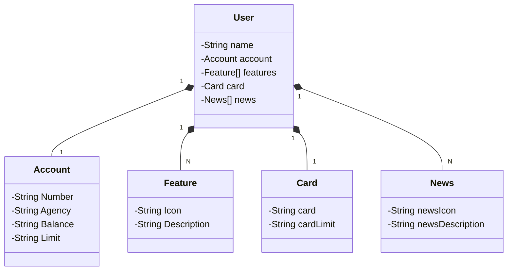

# DATABASE Mwana
Java RESTfull API criada para uma ONG Mwana

## Diagrama de classes

```mermaid
classDiagram
  class User {
    -String name
    -Account account
    -Feature[] features
    -Card card
    -News[] news
}

class Account {
  -String Number
  -String Agency
  -String Balance
  -String Limit
}

class Feature {
  -String Icon
  -String Description
}

class Card {
  -String card
  -String cardLimit
}

class News {
  -String newsIcon
  -String newsDescription
}

User "1" *-- "1" Account
User "1" *-- "N" Feature
User "1" *-- "1" Card
User "1" *-- "N" News
```
